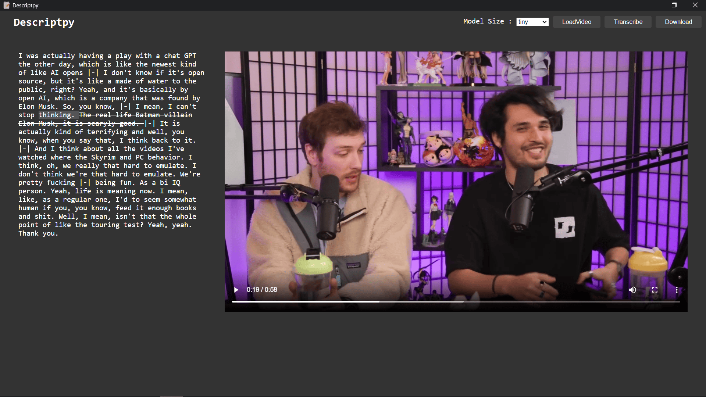

# DescriptPy
An open source Descript Alternative cause it very much possible.

feel free to open any issue regarding any feature or bug

This repository aims to do what descripts does for paid in a free version, technologies used are eel for the frontend and python in the backend for transcription openai whisper is used , for editing the video on the backend moviepy is used and u can find other dependencies in the pipfile 

Here is a demo of the application

click on any word to stike it out and remove from the video click on it again to unstike it and the current word being spoken is being highlighted 

### how the application works

we used python eel to render the webpage in public directory from them when the button load video is clicked python opens a filedialog to get the path and creates a temporary copy of the file in the public directory and then the video is loaded from there after that when button transcribe is clicked the transripts are made in whisper and sent back to front where they are processed and displayed accordingly after that when user clicks download video a filedialog is again raised for path and file name and the video is edited and saved

